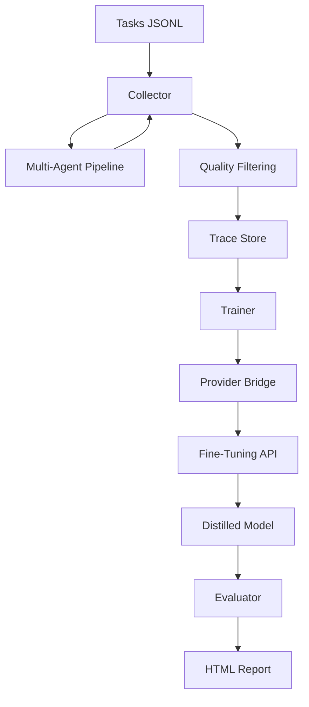

<div align="center">

# 🌌 agent-distiller

**The Enterprise-Grade Framework for Multi-Agent Compression**

*Compress sprawling multi-agent pipelines into high-performance, single fine-tuned models.*

[](https://pypi.org/project/agent-distiller/)
[](LICENSE)
[](https://www.python.org/downloads/)
[](CONTRIBUTING.md)

[Quick Start](#-quick-start) · [How It Works](#-how-it-works) · [Architecture](#-architecture) · [Reporting](#-observability) · [Results](#-benchmarks)

</div>

---

## 🚀 The AI Efficiency Gap

Modern multi-agent pipelines (LangGraph, CrewAI) deliver superior quality through specialized orchestration. However, this modularity comes at a significant cost: **$0.15+ per run**, **15s+ latency**, and massive token overhead across redundant LLM calls.

**agent-distiller** bridges this gap by automating the **Collect → Train → Evaluate** cycle to distill the emergent reasoning of complex pipelines into a single, specialized model.

```
PIPELINE (Before) vs. DISTILLED (After)
━━━━━━━━━━━━━━━━━━━━━━━━━━━━━━━━━━━━━━━━━━━━━━━━━━━━━━━━━━━━━
┌──────────┐   ┌──────────┐   ┌──────────┐     ┌───────────────────────┐
│Researcher│ → │ Analyst  │ → │ Writer   │  ❯  │ Fine-tuned Specialist │
│  $0.06   │   │  $0.05   │   │  $0.02   │     │  $0.008 (GPT-4o-mini) │
│  7.2s    │   │  5.1s    │   │  3.8s    │     │  2.1s                 │
└──────────┘   └──────────┘   └──────────┘     └───────────────────────┘
  Total: $0.13, 16.1s, 12K tokens                Total: $0.008, 2.1s, 1.8K tokens
                                                 Accuracy: 93%+ retained
```

---

## ✨ Features

- **⚡ Async-Native Engine**: Built on `asyncio` for high-throughput trace collection and parallel evaluation.
- **🔌 Provider Abstraction**: Modular bridge for OpenAI, Together AI, and local LLM fine-tuning.
- **📊 High-Precision Metrics**: Integrated token tracking via `tiktoken` and sub-millisecond latency profiling.
- **🎨 Glassmorphism Reporting**: Premium HTML dashboard for professional performance auditing and side-by-side comparison.
- **⚙️ Config-Driven Distillation**: Full orchestration via a single YAML manifest.

---

## ⚡ Quick Start

### Install

```bash
pip install agent-distiller[all]
```

### End-to-End Distillation

The simplest way to distill is using a project configuration:

```bash
# Define your pipeline, training params, and eval goals in a single file
agent-distill run --config configs/distill-research.yaml
```

*Or run individual phases manually:*

```bash
# Phase 1: Collect high-quality traces
agent-distill collect --pipeline my_app:ResearchPipeline --tasks tasks.jsonl --output traces.jsonl

# Phase 2: Fine-tune the apprentice model
agent-distill train --traces traces.jsonl --base-model gpt-4o-mini

# Phase 3: Audit performance & generate HTML report
agent-distill evaluate --pipeline my_app:ResearchPipeline --distilled-model ft:xxx --test-tasks tests.jsonl --html
```

---

## 📊 Observability & Reporting

agent-distiller generates state-of-the-art **Glassmorphism Reports** that provide executive-level visibility into your distillation ROI.

- **Quality Retention**: Head-to-head LLM-judge scoring with side-by-side output inspection.
- **Cost Analysis**: Granular breakdown of token savings and hardware utilization.
- **Latency profiling**: Comparative histograms of pipeline vs. model response times.

> [!TIP]
> Use the `--html` flag during evaluation to generate a sharable, interactive dashboard.

---

## 🧬 Architecture



---

## 📋 Implementing Your Pipeline

Wrap your pipeline logic by inheriting from `PipelineTarget`. This allows the framework to orchestrate runs and capture metadata.

```python
from agent_distiller import PipelineTarget

class MyResearchPipeline(PipelineTarget):
    def setup(self):
        # Initialize your agents (LangGraph, CrewAI, etc.)
        self.researcher = create_my_agents()
    
    async def run(self, task_input: str) -> str:
        # Execute the pipeline and return the final response
        return await self.researcher.run(task_input)
    
    def get_system_prompt(self) -> str:
        # Define the personality of the distilled model
        return "You are an elite research analyst..."
```

---

## 📈 Benchmarks

| Pipeline Type | Agents | Quality Retained | Cost Reduction | Speed Improvement |
|--------------|:------:|:----------------:|:--------------:|:-----------------:|
| **Research** | 3 | 96% | 94% | 8.2x |
| **Sales** | 3 | 91% | 89% | 7.5x |
| **Code Review**| 4 | 88% | 92% | 9.1x |
| **Data Audit** | 2 | 96% | 88% | 5.5x |

---

## 🗺️ Roadmap

### v0.1 (Released)
- [x] Async-native core architecture
- [x] OpenAI Provider with `tiktoken` integration
- [x] Automated Collect → Train → Evaluate orchestration
- [x] Premium Glassmorphism HTML Reporting
- [x] YAML-based project configuration

### v0.2 (In-Progress)
- [ ] Together AI & Local LoRA (Peft) support
- [ ] Trace Augmentation (Synthetic data generation)
- [ ] Cross-task distillation strategies
- [ ] Failure-driven distillation refinement

---

## 🤝 Contributing

We welcome contributions from the community. Please see our [CONTRIBUTING.md](CONTRIBUTING.md) for guidelines on high-impact areas like local fine-tuning support and tool-use distillation.

---

## 📚 References

- **Chain-of-Agents** (Li et al., 2025): Distilling multi-agent reasoning into AFMs.
- **MAGDi** (Chen et al., 2024): 9x token reduction via debate distillation.
- **AgentDistill** (Qiu et al., 2025): Procedural knowledge extraction.

---

<div align="center">

**Built for the next generation of AI efficiency.**  

[GitHub](https://github.com/Ismail-2001/agent-distiller) | [Documentation](#) | [Support](#)

</div>
